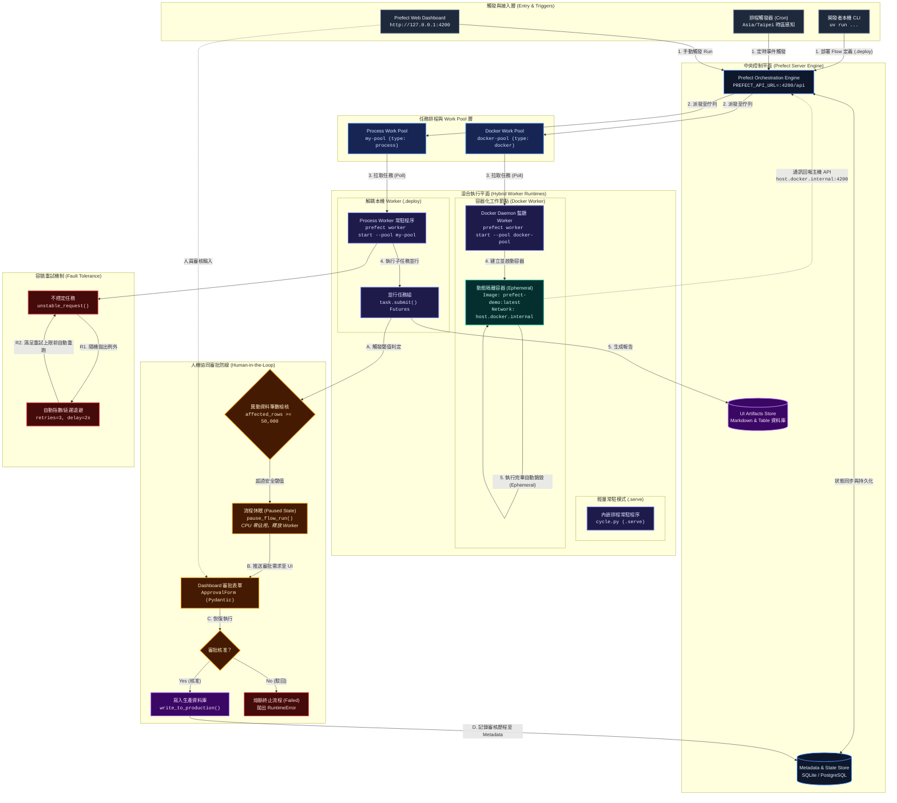
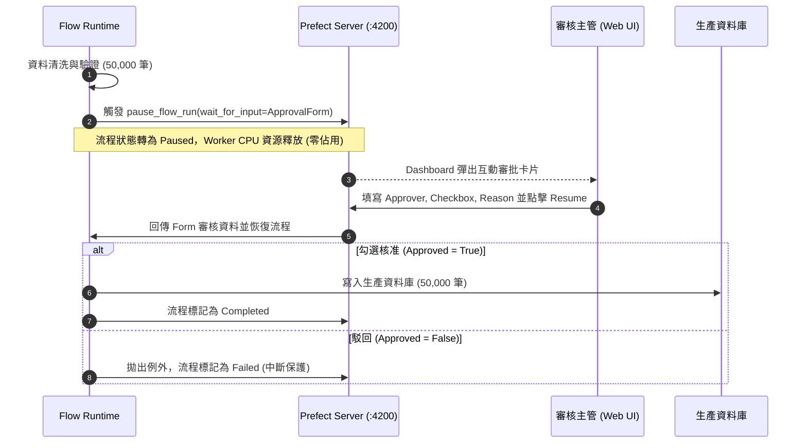

# Prefect 3.x 企業級工作流編排與混合 Worker 實戰專案

基於 **Prefect 3.x**、**Python 3.12** 與 **uv** 建構的新一代雲原生工作流排程與資料編排系統。專案整合輕量開發排程（`.serve()`）、生產級解耦部署（`.deploy()`）、混合式工作池（Process Pool & Docker Pool）、Human-in-the-Loop（HITL）人工審批安全防線，以及 Serverless-ready 的結構化 UI 自訂報表（Artifacts）展示。

---

## 系統架構

系統涵蓋「**主執行鏈路**（1~5）」、「**HITL 人工審查安全鏈路**（A~D）」與「**任務失敗重試治理**（R1~R2）」：



---

## 專案結構

本專案採用清晰的模組化切分，涵蓋從入門 Flow 到生產級 Docker/HITL 的完整示範：

```bash
prefectDemo/
├── .python-version                # Python 執行版本鎖定 (3.12)
├── pyproject.toml                 # 專案依賴定義 (Prefect 3.8+, prefect-docker, prefect-email)
├── uv.lock                        # 跨平台相依性精確鎖定檔 (uv package manager)
├── README.md                      # 專案系統架構、各模組實作指南與維運手冊
├── src/
│   └── prefectdemo/
│       ├── __init__.py            # Python 套件初始化入口
│       ├── main.py                # [基礎入門] Flow / Task 裝飾器、Logger 與基礎重試設定
│       ├── mainError.py           # [容錯機制] 模擬不穩定連線、自訂 retries 與 retry_delay_seconds
│       ├── cycle.py               # [並行編排] Dynamic Tasks、task.submit() 與 Futures 依賴控制
│       └── hitl_demo.py           # [人機協同] Pydantic RunInput 表單、pause_flow_run 流程暫停與 UI 審批
├── artifacts/
│   └── artifacts_demo.py          # [可視化] 產出 Markdown Artifact 與 Table Artifact 報表展示
├── cron/
│   └── cycle.py                   # [輕量排程] 內嵌 Worker 模式，使用 .serve() 與時區感知 Cron
├── worker/
│   └── deploy.py                  # [生產解耦] Work Pool + .deploy() 部署模式，解耦程式碼與執行 Worker
└── docker/
    ├── Dockerfile                 # 容器化建構檔 (基於 python:3.12-slim，內建 uv 雙階段相依性快取)
    └── deploy_docker.py           # [容器調度] Docker Work Pool 部署腳本，支援 host.docker.internal 穿透
```

---

## 環境初始化

專案全面使用現代化 Python 工具鏈 [uv](https://github.com/astral-sh/uv) 進行環境管理：

```bash
# 1. 進入專案目錄
cd prefectDemo

# 2. 安裝依賴環境 (自動建立 .venv 並同步 uv.lock)
uv sync

# 3. 啟動 Prefect 獨立後端 Server (Web Dashboard & API Engine)
uv run prefect server start
```

* **Web Dashboard 網址**：`http://127.0.0.1:4200`
* **API 端點**：`http://127.0.0.1:4200/api`

> [!TIP]
> **開發環境資料重置**：
> 若需要清空所有歷程記錄、Deployment 與 Work Pool：
> ```bash
> uv run prefect server database reset -y
> rm -f ~/.prefect/prefect.db*
> rm -rf ~/.prefect/storage/*
> ```

---

## 核心主題與實踐指南

### 主題一：基礎 Flow / Task 與並行運算

示範最核心的任務裝飾器、日誌系統、錯誤自動重試，以及基於 Futures 的任務並行分發：

```bash
# 1. 執行基礎 Task 串聯與 Logger 示範
uv run src/prefectdemo/main.py

# 2. 執行 50% 失敗率模擬與自動指數重試
uv run src/prefectdemo/mainError.py

# 3. 執行 Dynamic Task 並行分發 (submit() 模式)
uv run src/prefectdemo/cycle.py
```

* **核心技術點**：
  * `@task(retries=3, retry_delay_seconds=2)`：無痛實現暫態錯誤自我修復。
  * `task.submit(item)`：將 Task 封裝為 Future 非同步執行，單一子任務失敗不阻礙主流程。

---

### 主題二：輕量 Cron 排程（`.serve()`）

適用於**本機開發或單一主機快速排程**。腳本自身即為 Worker，保持前景執行即可接單。

```bash
PREFECT_API_URL=http://127.0.0.1:4200/api uv run ./cron/cycle.py
```

* **時區設定**：支援 `Cron("*/1 * * * *", timezone="Asia/Taipei")`，防止跨時區排程偏移。

---

### 主題三：生產級解耦 Work Pool & Worker（`.deploy()`）

將 **Flow 的定義（程式碼）** 與 **執行主機（Worker）** 徹底解耦。

#### `.serve()` vs `.deploy()` 架構對比

| 比較維度 | `.serve()` | `.deploy()` (生產推薦) |
|---|---|---|
| **架構角色** | 執行腳本「自己」就是 Worker | 僅向 Prefect Server 登記 Deployment，由獨立 Worker 執行 |
| **適用場景** | 本機快速除錯、單機腳本 | 正式生產環境、多主機負載平衡、跨環境調度 |
| **執行環境** | 固定為啟動該腳本的 Process | 自由切換（Process、Docker 容器、K8s Job、Cloud Run） |
| **水平擴展** | ❌ 難以彈性動態擴展 | ✅ 可隨時增加 Worker 實例並行消化佇列 |

#### 操作流程

```bash
# 步驟 1：建立 Process 類型的工作池 (只需執行一次)
prefect work-pool create my-pool --type process

# 步驟 2：啟動 Worker 監聽該池 (需獨立終端機常駐執行)
PREFECT_API_URL=http://127.0.0.1:4200/api uv run prefect worker start --pool my-pool

# 步驟 3：向 Work Pool 登記 Flow Deployment
PREFECT_API_URL=http://127.0.0.1:4200/api uv run ./worker/deploy.py

# 步驟 4：至 Dashboard 或透過 CLI 觸發執行
PREFECT_API_URL=http://127.0.0.1:4200/api prefect deployment run 'ETL Pipeline（Work Pool 版）/etl-deployment'
```

---

### 主題四：容器化隔離工作節點（Docker Worker）

在獨立 Docker 容器內執行 Flow，**每次觸發建立全新容器，執行完畢即刻銷毀**，保證乾淨、無污染的執行環境。

#### Process Worker vs Docker Worker 對比

| 比較維度 | Process Worker | Docker Worker (容器化) |
|---|---|---|
| **隔離級別** | 主機 Process 等級（共用 Python 環境與相依性） | 完全隔離（獨立 Container 檔案系統與 Runtime） |
| **環境一致性** | 易受主機全域環境變化影響 | 映像檔固定（CI/CD 打包即確定，杜絕環境差異） |
| **接近生產** | ❌ 僅適用本機或特定 VM | ✅ 最貼近 Kubernetes、Cloud Run 與 ECS 架構 |
| **冷啟動開銷** | 極低（毫秒級直接啟動） | 輕微延遲（需啟動 Docker 容器與掛載） |

#### 操作流程

```bash
# 步驟 1：建構本地 Docker 映像檔 (在專案根目錄執行)
docker build -f docker/Dockerfile -t prefect-demo:latest .

# 步驟 2：建立 Docker 類型的 Work Pool (只需一次)
prefect work-pool create docker-pool --type docker

# 步驟 3：啟動 Docker Worker 監聽 (開新終端機常駐)
PREFECT_API_URL=http://127.0.0.1:4200/api uv run prefect worker start --pool docker-pool

# 步驟 4：登記 Docker Deployment
PREFECT_API_URL=http://127.0.0.1:4200/api uv run ./docker/deploy_docker.py

# 步驟 5：觸發執行並觀察容器動態建立與釋放
PREFECT_API_URL=http://127.0.0.1:4200/api prefect deployment run 'ETL Pipeline（Docker 版）/etl-docker-deployment'
```

#### 關鍵網路架構：`host.docker.internal`
容器具備獨立網路命名空間，容器內的 `localhost` 無法抵達主機的 Prefect Server。因此容器內預設指定：
```
PREFECT_API_URL=http://host.docker.internal:4200/api
```
確保容器內運行的 Flow 能無縫回報狀態給主機 Server。

#### `image_pull_policy` 策略表

| 參數值 | 行為定義 | 適用情境 |
|---|---|---|
| `"Never"` | 僅使用本機 Docker Image，不存在直接拋錯 | 本機快速開發與除錯 |
| `"IfNotPresent"` | 本機無快取時才連外 Pull | 正式環境推薦 |
| `"Always"` | 每次執行皆強制向 Registry 重新拉取最新 Image | 結合 CI/CD 自動交付 |

---

### 主題五：UI 結構化報表（Artifacts）

告別繁雜的純文字 Log！透過 Prefect Artifacts 將結構化商業報告直接持久化至 Server，在 Web Dashboard 上可視化渲染。

```bash
PREFECT_API_URL=http://127.0.0.1:4200/api uv run artifacts/artifacts_demo.py
```

* **功能特點**：
  * **Markdown Artifacts**：使用 `create_markdown_artifact()` 輸出高質感數據卡片、KPI 指標與警示排版。
  * **Table Artifacts**：使用 `create_table_artifact()` 將門市明細、批次狀態渲染為可排序的互動式表格。
  * **無實體檔案負擔**：資料直接儲存於 Prefect Metadata，不佔用本機或容器暫存空間。

---

### 主題六：人機協同治理（Human-in-the-Loop, HITL）

在遇到重大操作（如異動大量資料、跨庫遷移、模型上線）時，讓工作流主動觸發**安全暫停（Paused）**，釋放 Worker 運算資源，並在 Web UI 彈出表單等待維運人員審批。

```bash
PREFECT_API_URL=http://127.0.0.1:4200/api uv run src/prefectdemo/hitl_demo.py
```



* **核心機制**：
  * 基於 Pydantic 定義 `ApprovalForm(RunInput)`，強型別校驗審核欄位。
  * 暫停期間不佔用 CPU 執行線程，支援分散式非同步恢復。

---

## 常用維運指令速查

```bash
# ── 1. Work Pool 管理 ──────────────────────────────────────────
prefect work-pool ls                                    # 列出所有工作池
prefect work-pool inspect my-pool                       # 檢視指定池詳細配置
prefect work-pool create test-pool --type process       # 建立 Process 工作池
prefect work-pool create docker-pool --type docker      # 建立 Docker 工作池
prefect work-pool delete <pool-name>                    # 刪除指定工作池

# ── 2. Worker 啟動 ───────────────────────────────────────────
PREFECT_API_URL=http://127.0.0.1:4200/api uv run prefect worker start --pool my-pool
PREFECT_API_URL=http://127.0.0.1:4200/api uv run prefect worker start --pool docker-pool

# ── 3. Deployment 管理與觸發 ──────────────────────────────────
prefect deployment ls                                   # 列出已登記的 Deployment
# 手動觸發 Process 版 ETL
PREFECT_API_URL=http://127.0.0.1:4200/api prefect deployment run 'ETL Pipeline（Work Pool 版）/etl-deployment'
# 手動觸發 Docker 版 ETL
PREFECT_API_URL=http://127.0.0.1:4200/api prefect deployment run 'ETL Pipeline（Docker 版）/etl-docker-deployment'

# ── 4. Docker 容器運作檢視 ────────────────────────────────────
docker build -f docker/Dockerfile -t prefect-demo:latest . # 建構映像檔
docker images | grep prefect-demo                         # 確認映像檔存在
docker ps                                                 # 觸發執行時可見容器動態建立
```
